# Web Application Penetration Testing using SQL Injection (DVWA)

## Project Overview
This project demonstrates a complete SQL Injection attack on a vulnerable web application (DVWA). The assessment was performed using both manual testing techniques with Burp Suite and automated exploitation using sqlmap. The objective was to identify, exploit, and analyze SQL Injection vulnerabilities and understand their impact.

## Tools Used
- Burp Suite
- sqlmap
- Kali Linux
- DVWA (Damn Vulnerable Web Application)

## Vulnerability: SQL Injection
SQL Injection is a vulnerability that allows attackers to manipulate database queries by injecting malicious input. This can lead to unauthorized access, data leakage, and full database compromise.

## Manual Testing using Burp Suite

### 1. Capturing Request
The HTTP request was intercepted using Burp Suite Proxy to analyze how user input is sent to the server.

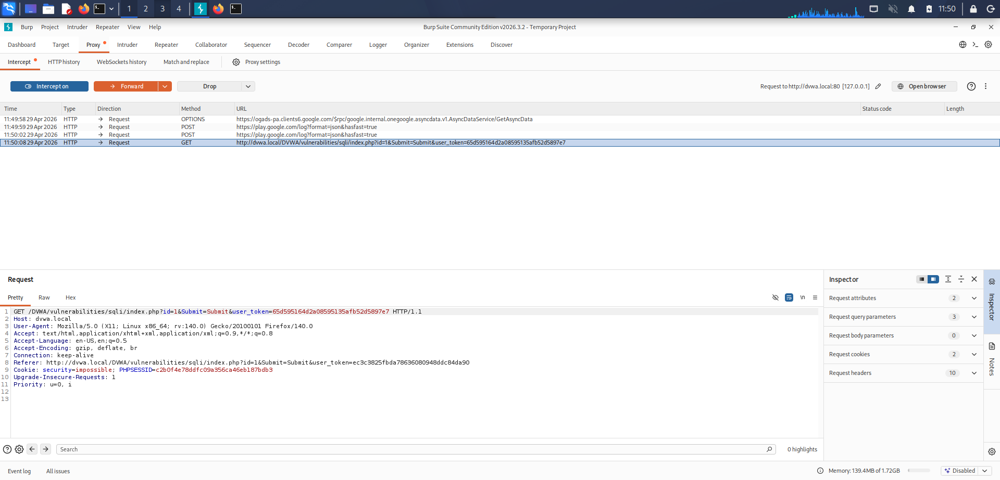

---

### 2. Sending Request to Repeater
The intercepted request was forwarded to Burp Repeater to manually modify and test input values.

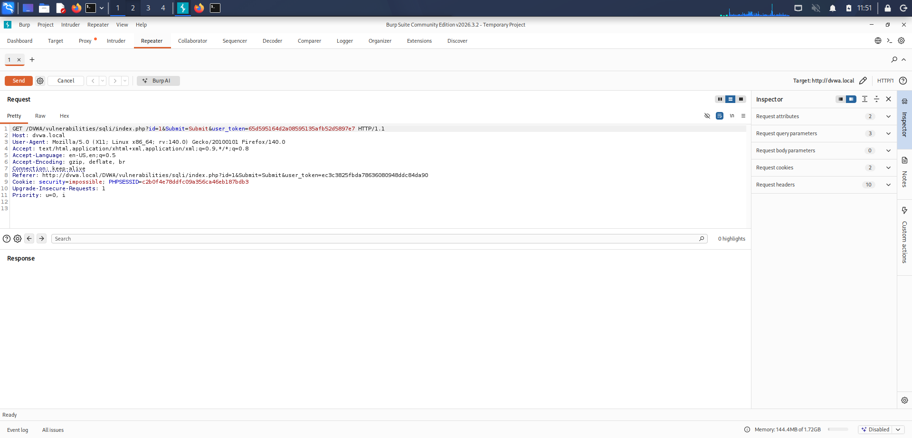

---

### 3. Normal Request Response
A normal input (`id=1`) was submitted to observe the standard application behavior and establish a baseline.

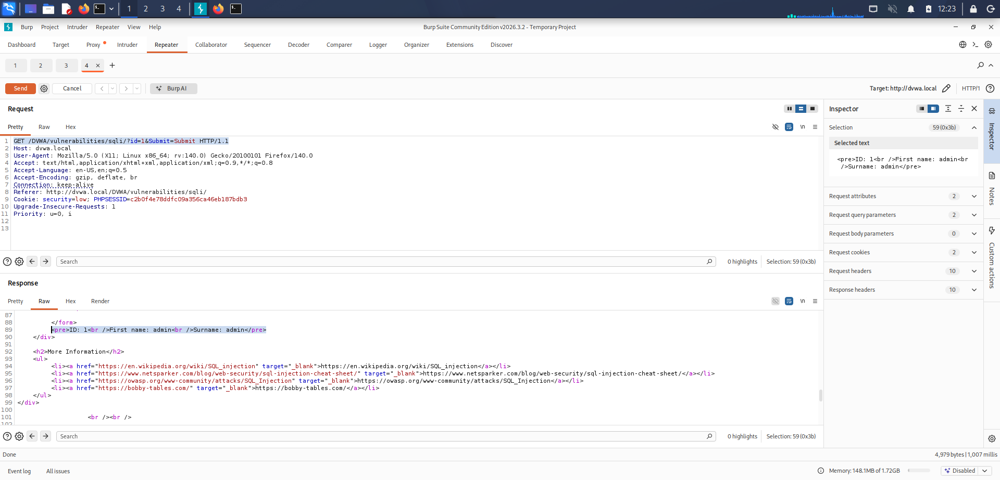

---

### 4. Boolean-Based SQL Injection
A payload (`1' OR '1'='1`) was injected to manipulate the query logic. This caused the condition to always evaluate as TRUE, resulting in the retrieval of multiple user records.

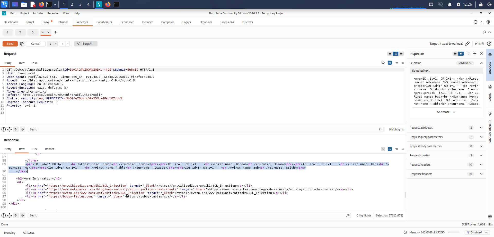

---

### 5. UNION-Based SQL Injection
A UNION-based payload was used to extract additional data from the database. This allowed retrieval of usernames and password hashes from the backend database.

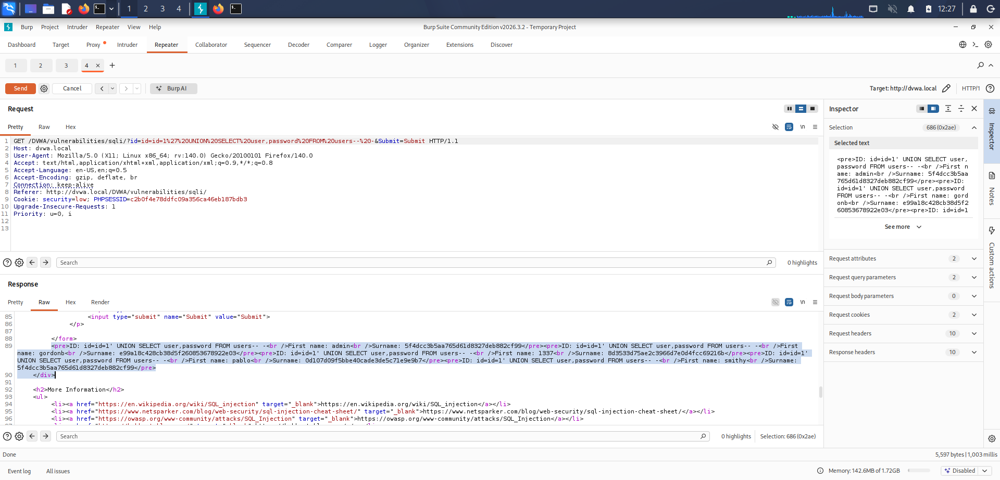

---

## Automated Testing using sqlmap

### 6. Executing sqlmap Command
sqlmap was used to automate the detection and exploitation of the SQL Injection vulnerability.

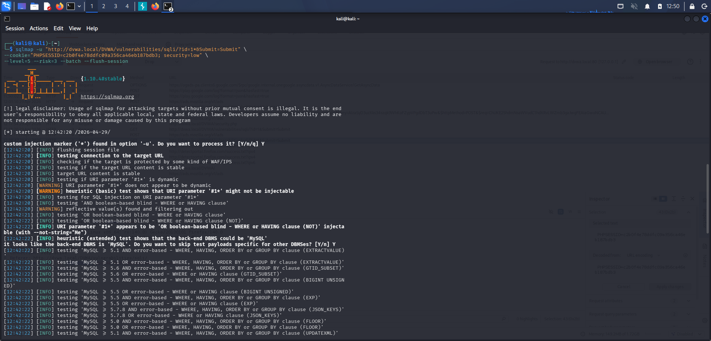

---

### 7. Vulnerability Detection
sqlmap confirmed that the parameter is vulnerable to SQL Injection.

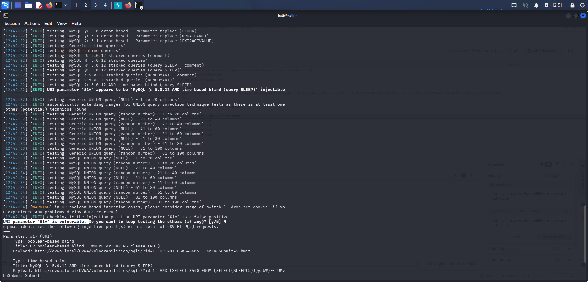

---

### 8. Identified Injection Techniques
sqlmap identified multiple injection types:
- Boolean-based Blind SQL Injection  
- Time-based Blind SQL Injection  

These techniques confirm that the application is vulnerable even when direct output is not visible.

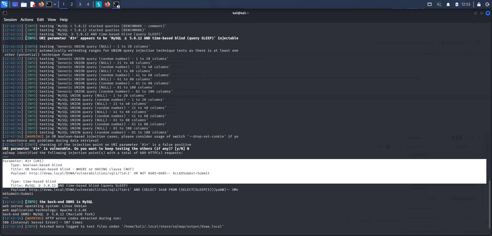

---

### 9. Database Enumeration
The available databases were enumerated using sqlmap, confirming access to the backend database system.

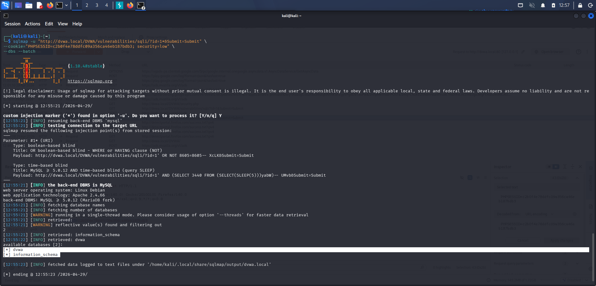

---

### 10. Tables Enumeration
Tables within the target database (`dvwa`) were identified, including the `users` table.

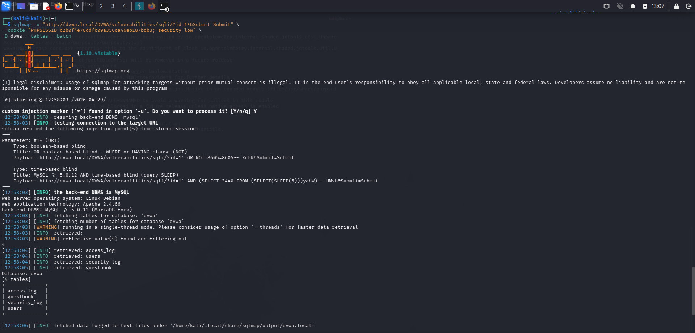

---

### 11. Data Extraction Command
sqlmap was used to extract data from the identified table.

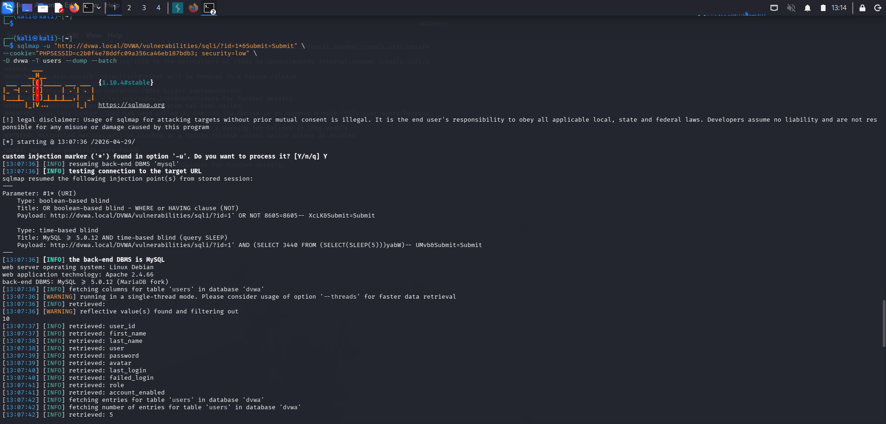

---

### 12. Extracted User Credentials
Usernames and password hashes were successfully retrieved from the database, demonstrating the impact of the vulnerability.

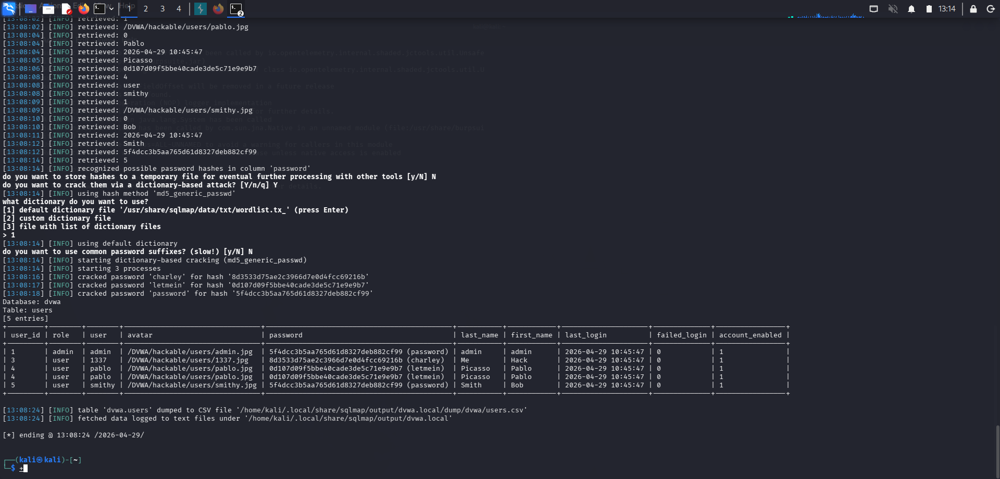

---

### 13. Backend Database Information
Additional details about the backend DBMS and environment were identified.

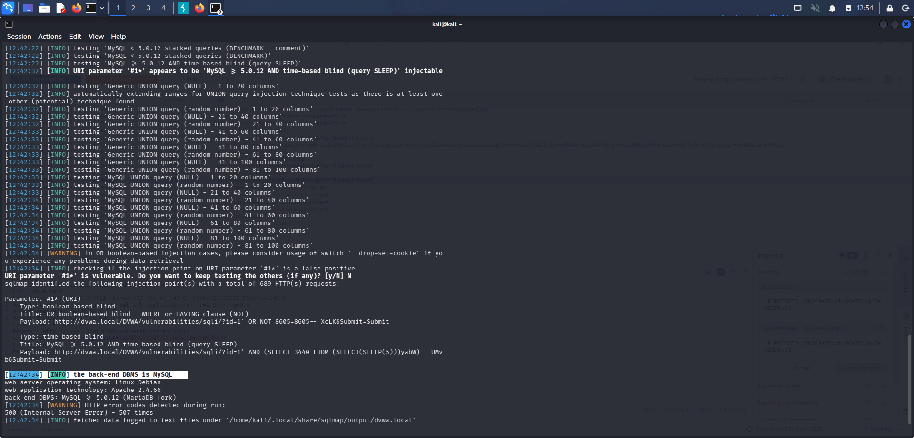

---

## Impact
- Unauthorized access to database
- Exposure of user credentials
- Authentication bypass
- Sensitive data leakage

## Mitigation
- Use prepared statements and parameterized queries
- Validate and sanitize user inputs
- Apply least privilege principle on database accounts
- Implement Web Application Firewall (WAF)

## Conclusion
This project demonstrates how SQL Injection vulnerabilities can be identified and exploited using both manual and automated techniques. It highlights the importance of secure coding practices and proper input validation in web applications.
